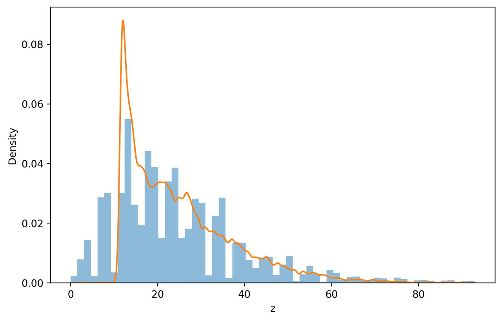

# Learning Probability Density Functions using GANs

## Overview
This project demonstrates how to learn an unknown probability density function using data-only learning, without assuming any parametric form of the distribution. A Generative Adversarial Network (GAN) is trained to model the distribution of a transformed random variable derived from real-world air quality data.

This work was completed as part of Assignment–2: Learning Probability Density Functions using Data Only.

---

## Dataset
- Source: India Air Quality Dataset (Kaggle)
- Feature Used: NO₂ concentration
- The NO₂ column is automatically detected from the dataset
- Extreme outliers above the 99th percentile are removed for stable GAN training

---

## Data Transformation
Each NO₂ value x is transformed into a new variable z using:

z = x + a_r sin(b_r x)

### Transformation Parameters
a_r = 2.5  
b_r = 1.2

The GAN is trained only on samples of the transformed variable z, with no access to the original data distribution.

---

## GAN Architecture

### Generator
Linear(1, 32) → ReLU → Linear(32, 32) → ReLU → Linear(32, 1)

### Discriminator
Linear(1, 32) → ReLU → Linear(32, 32) → ReLU → Linear(32, 1) → Sigmoid

---

## Training Details
- Loss Function: Binary Cross-Entropy
- Optimizer: Adam
- Learning Rate: 0.0002
- Batch Size: 64
- Epochs: 4000
- Device: CPU

---

## PDF Approximation
After training the GAN:
1. A large number of samples are generated from the generator
2. Kernel Density Estimation (KDE) is applied to estimate the learned probability density function
3. The estimated PDF is compared with the histogram of real transformed data

---

## Results Visualization
The plot below compares the histogram of real transformed data z with the KDE-based PDF estimated from GAN-generated samples.

---

## Distribution Statistics
Real mean: 24.820277878142374  
Generated mean: 24.538557  
Real std: 15.127542287695501  
Generated std: 10.279615

---

## Observations

### Mode Coverage
Primary modes are well covered by the generator.

### Training Stability
Training converged without divergence or mode collapse.

### Quality of Generated Distribution
Generated samples closely follow the real data distribution, indicating successful learning of the underlying probability density.

---

## How to Run
1. Download the dataset from Kaggle
2. Place data.csv in the input directory
3. Run the provided Python script
4. The output includes:
   - PDF plot
   - Transformation parameters
   - GAN architecture
   - Statistical comparison and observations

---

## Requirements
- Python 3.x
- NumPy
- Pandas
- Matplotlib
- Scikit-learn
- PyTorch

---

## Notes
- No analytical or parametric PDF is assumed
- The GAN learns the distribution strictly from samples
- The implementation follows all assignment constraints
